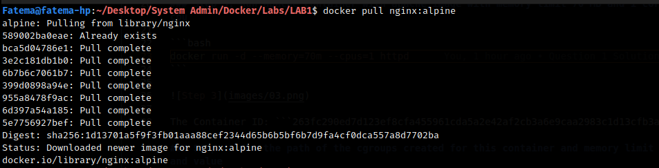
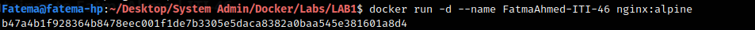
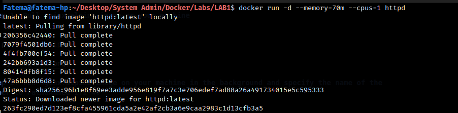
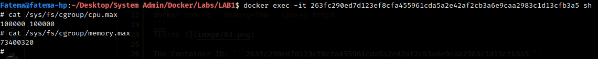
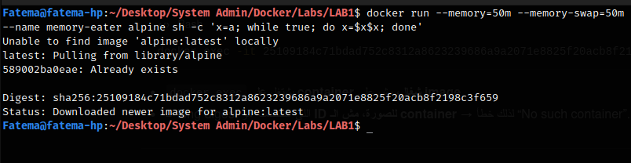
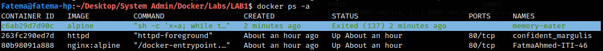

# LAB #1

## Question 1

### Step 1: Pull nginx:alpine image on your machine

```bash
docker pull nginx:alpine
```


### Step 2: run nginx:alpine image on your machine in the background and specify the name of the container to FatmaAhmed-ITI-46

```bash
docker run -d --name FatmaAhmed-ITI-46 nginx:alpine
```



### Step 3: Run apache container with apache image with memory limit 70 MB and 1 core of cpu

```bash
docker run -d --memory=70m --cpus=1 httpd
```



The Container ID: ```263fc290ed7d123ef8cfa455961cda5a2e42af2cb3a6e9caa2983c1d13cfb3a5```

### Step 4: Get the path of the cgroups created for this container and memory limit file and value

```bash
docker exec -it 263fc290ed7d123ef8cfa455961cda5a2e42af2cb3a6e9caa2983c1d13cfb3a5 sh
```

```shell
# cat /sys/fs/cgroup/cpu.max
# cat /sys/fs/cgroup/memory.max
```



---

## Question 2 - Bonus

### Steps:

- Run an alpine container called memory-eater with memory limit of 50M
- Make sure that the container does not use swap memory as well
- Construct the container such that it should consume more than 50M of memory
- Prove that container is being killed by the OOM killer

```bash
docker run --memory=50m --memory-swap=50m --name memory-eater alpine sh -c 'x=a; while true; do x=$x$x; done'
```



Status: ```Exited (137)```
Exit Code = 128 + Signal Number ```SIGKILL = 9```


