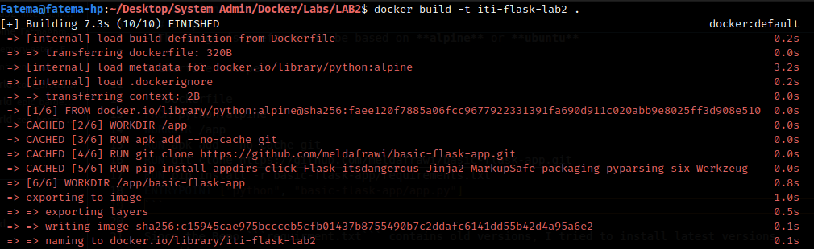
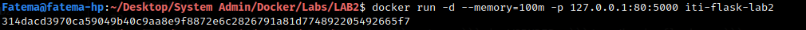
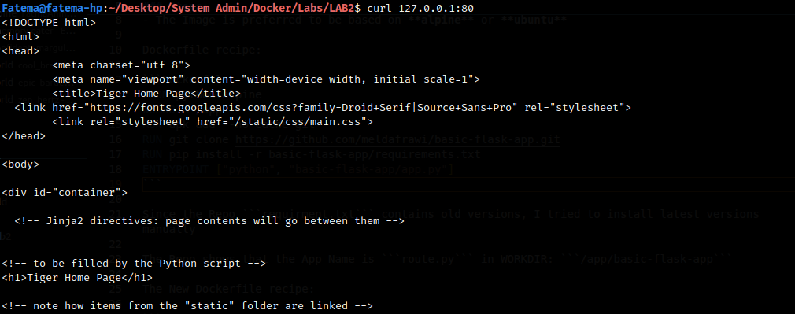
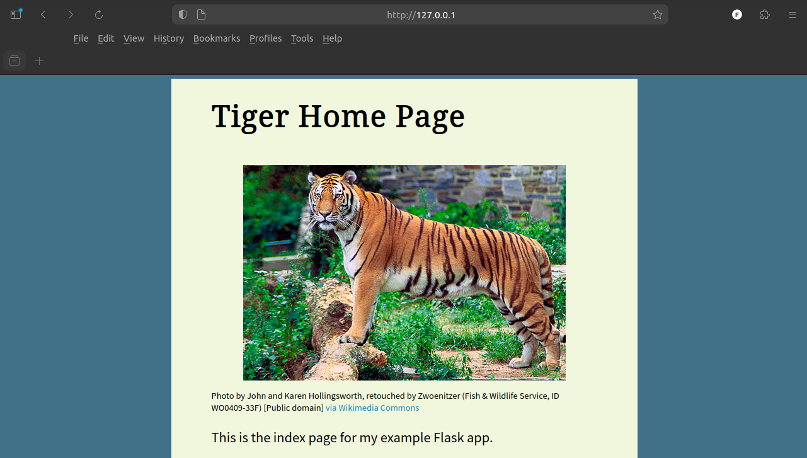
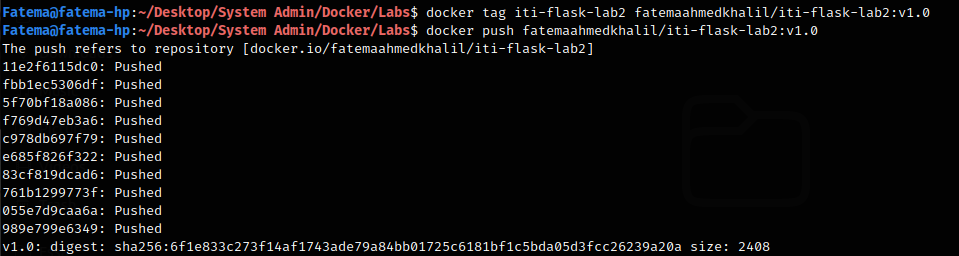
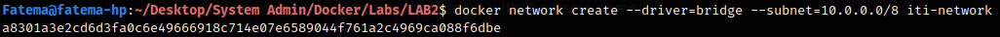
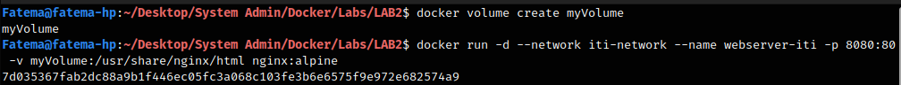
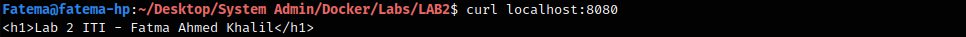

# LAB #2

## Question 1

### Steps:

- Build python flask image with the name **ITI-flask-lab2** from repo ```https://github.com/meldafrawi/basic-flask-app.git```
- The Image is preferred to be based on **alpine** or **ubuntu**

Dockerfile recipe:

```Dockerfile
FROM python:alpine
WORKDIR /app
RUN apk add --no-cache git
RUN git clone https://github.com/meldafrawi/basic-flask-app.git
RUN pip install -r basic-flask-app/requirements.txt
ENTRYPOINT ["python", "basic-flask-app/routes.py"]
```

Since the Repo ```requirment.txt``` contains old versions, I tried to install latest versions by removing the old version numbers from the file

The Repo shows that the App Name is ```route.py``` in WORKDIR: ```/app/basic-flask-app```

The New Dockerfile recipe:

```Dockerfile
FROM python:alpine
WORKDIR /app
RUN apk add --no-cache git
RUN git clone https://github.com/meldafrawi/basic-flask-app.git

# Go to App Work Directory
WORKDIR /app/basic-flask-app

#Remove the old versions from requirment.txt file
RUN sed -i 's/==.*//g' requirements.txt

#Install requirment in latest version
RUN pip install -r requirements.txt

CMD [ "python", "routes.py" ]
```

Build the Image:

```bash
docker build -t iti-flask-lab2 .
```



- Run the image with memory limit 100MB
- Make sure that the image runs successfully on your machine and publish Port ```127.0.0.1:5000``` to Port ```80``` ON THE HOST

```bash
docker run -d --memory=100m -p 127.0.0.1:80:5000 iti-flask-lab2 
```




Run ```http://127.0.0.1:80``` or write in shell:

```bash 
curl 127.0.0.1:80
```





- Push the image to Docker Hub account ```fatemaahmedkhalil```

```bash
docker login
docker tag iti-flask-lab2 fatemaahmedkhalil/iti-flask-lab2:v1.0
docker push fatemaahmedkhalil/iti-flask-lab2:v1.0
```



---

## Question 2

### Steps:

- Create a new network and name it **iti-network**
- The new network should be a bridge driver and uses a Subnet ```10.0.0.0/8```

```bash
docker network create --driver=bridge --subnet=10.0.0.0/8 iti-network
```



- Run the image ```nginx:alpine``` or ```httpd```, and the container should:
    - Have the name **webserver-iti**
    - Publish the Port ```8080``` from within the container to Port ```8080```
    - The index page should have the text in ```Lab 2 ITI - (your name)```
    - You should use volumes for the index page

Create The Page ```index.html``` in my Host Machine

```bash
echo "<h1>Lab 2 ITI - Fatma Ahmed Khalil</h1>" > index.html
```

Create the Volume and run ```nginx:alpine```

```bash
docker volume create myVolume
docker run -d --network iti-network --name webserver-iti -p 8080:80 -v myVolume:/usr/share/nginx/html nginx:alpine
```



Copy the ```index.html``` to the running container

```bash
docker cp index.html webserver-iti:/usr/share/nginx/html
```


Test the Container

```bash
curl localhost:8080
```


