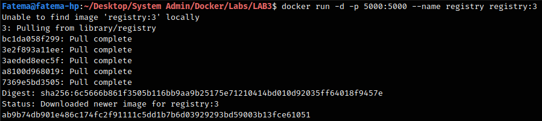
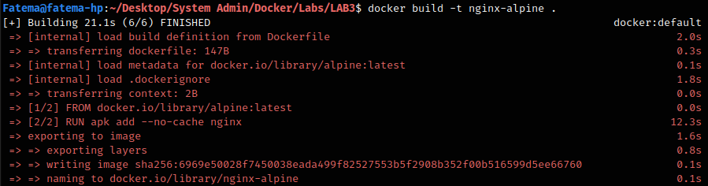
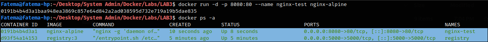
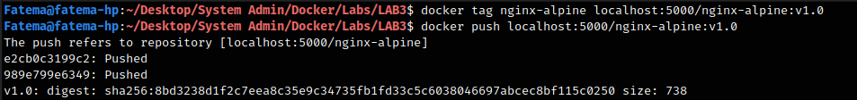
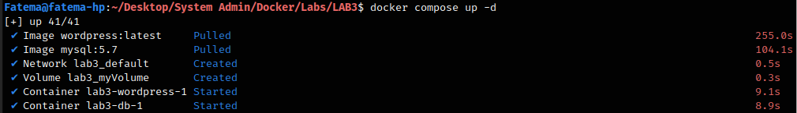
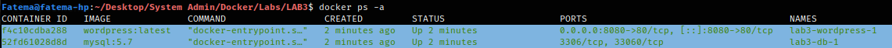
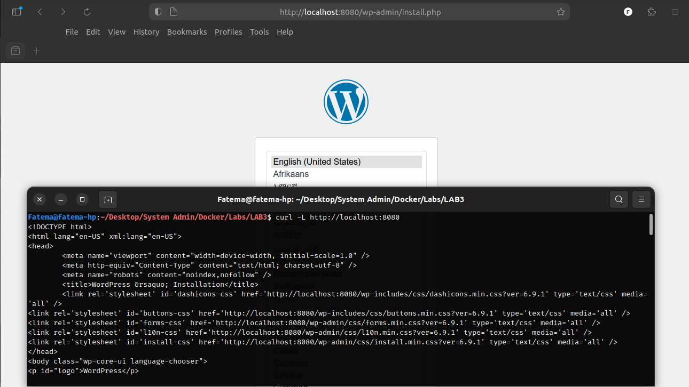
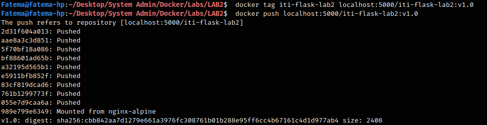
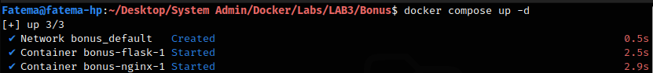

# LAB #3

## Question 1

### Steps:

- Run an insecure docker registry (cncf distribution) on your server, follow the docs for this ```https://docs.docker.com/registry/insecure/```

```bash
docker run -d -p 5000:5000 --name registry registry:3
```



- Create an image that installs and run nginx based on ```alpine:latest```

```Dockerfile
FROM alpine:latest
RUN apk add --no-cache nginx

#Start nginx in foreground
CMD ["nginx", "-g", "daemon off;"]
```

```bash
docker build -t nginx-alpine . 
```



to Test the container running

```bash
docker run -d -p 8080:80 --name nginx-test nginx-alpine
docker ps -a
```



- Push this created image to the private registry that you created

```bash
docker tag nginx-alpine localhost:5000/nginx-alpine:v1.0
docker push localhost:5000/nginx-alpine:v1.0 
```



---

## Question 2

### Steps:

- Create a docker compose file that runs wordpress image based on ```wordpress:latest``` image and ```mysql:5.7``` database and mount data directory of mysql to ```/var/lib/mysql``` on host
- The docker-compose file should have the two services and expose wordpress on Port ```8080``` on the host

The docker-compose.yml file:

```yml
services:
  db:
    image: mysql:5.7
    volumes:
      - myVolume:/var/lib/mysql
    environment:
      MYSQL_ROOT_PASSWORD: secret123
      MYSQL_DATABASE: wordpress_db

  wordpress:
    image: wordpress:latest
    ports:
      - "8080:80"
    environment:
      WORDPRESS_DB_HOST: db
      WORDPRESS_DB_USER: root
      WORDPRESS_DB_PASSWORD: secret123
      WORDPRESS_DB_NAME: wordpress_db

volumes:
  myVolume:
```

Run the compose file:

```bash
docker compose up -d
```



List the Up Containers:


Test WordPress:

```bash
curl -L http://localhost:8080
```



---

## Question 3

### Steps:

- In **LAB2** you created a Docker image for running an example Flask app, push this image to the private registry that you created in **Part1**

```bash
docker tag iti-flask-lab2 localhost:5000/nginx-alpine:v1.0
docker push localhost:5000/iti-flask-lab2:v1.0
```



- Create and run a docker compose file that runs this image and run it so that it will pull the image from the private registry
- Make sure that this container is exported on Port ```8080``` on the host and make sure that you can access the app
- Run nginx in front of the flask app and publish it on Port ```80``` and add it to the docker compose file (you can use ```httpd```)

The docker-compose.yml file that pulls the image from the private registry and sets up the Port mappings

I use a bind mount to attach the Nginx configuration file directly to the container
instead of building a custom Nginx image, and allows for easy updates.

```yml
services:
  flask:
    image: localhost:5000/iti-flask-lab2:v1.0
    ports:
      - "8080:5000"
      
  nginx:
    image: nginx:latest
    ports:
      - "80:80"
    volumes:
      - ./nginx.conf:/etc/nginx/conf.d/default.conf
```

Create a file named **nginx.conf** in the same directory of **docker-compose.yml**

By default, Nginx is configured to serve static HTML pages (like the standard "Welcome to nginx!" page). If we run Nginx without a custom configuration, it will not know that our Flask application exists, and it will not route any traffic to it.

To fix this, I write the nginx.conf file to act as an "instruction manual", It transforms Nginx from a simple web server into a **Reverse Proxy**.

```.conf
server {
    listen 80;

    location / {
        proxy_pass http://flask:5000;
    }
}
```

Run the Containers:

```bash
docker compose up -d
```



when open the browser to ```http://localhost:8080``` or ```http://localhost:80```


